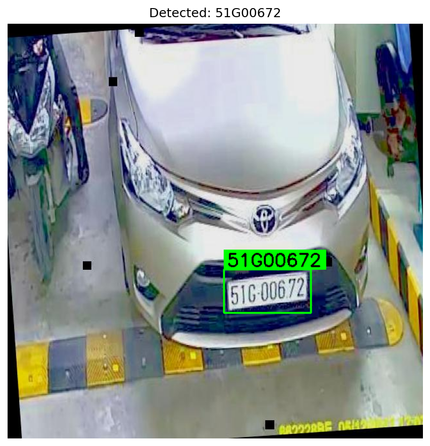

License Plate Detection and Reader (YOLO + EasyOCR)

This project detects and reads vehicle license plates using a **custom-trained YOLO model** and **EasyOCR** for text extraction.  
---
Prerequisite
1. Activate a Conda environment and install dependencies
 
```bash
conda create -n plate_ocr python=3.9 -y
conda activate plate_ocr

pip install ultralytics easyocr opencv-python

```
2. Dataset

This project was tested on the **License Plate Detection Dataset** from [Roboflow Universe]([https://universe.roboflow.com/betah/cars-plates-sqjgv]).

- **Source**: Roboflow
- **Dataset Version**: v3
- **License**: CC BY 4.0
All dataset credits belong to the original contributors on Roboflow.

3. YOLOv8 Model
The custom-trained YOLOv8 model used in this project was obtained from the following GitHub repository:

[[**<insert repo name here>**](https://github.com/Muhammad-Zeerak-Khan/Automatic-License-Plate-Recognition-using-YOLOv8)]

4. Add your file PATHS in cars_license_plate_ocr.py and run the program.

PLATE_IMAGE_PATH 
MODEL_PATH 

5. Results


